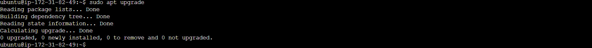
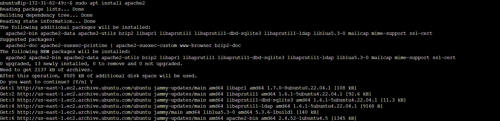
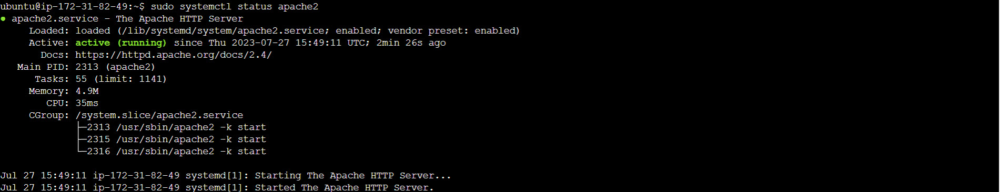
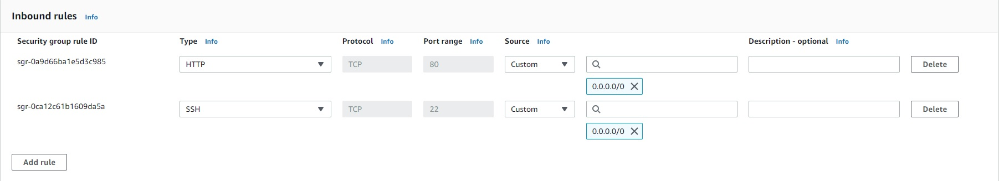
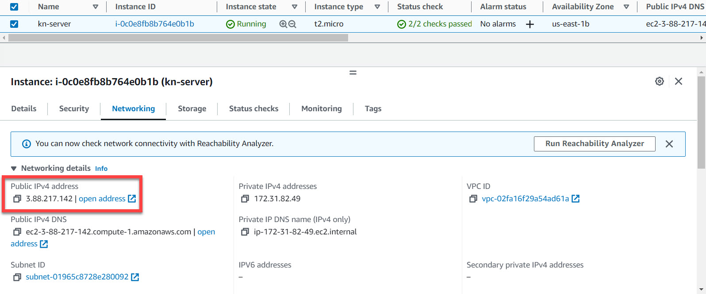
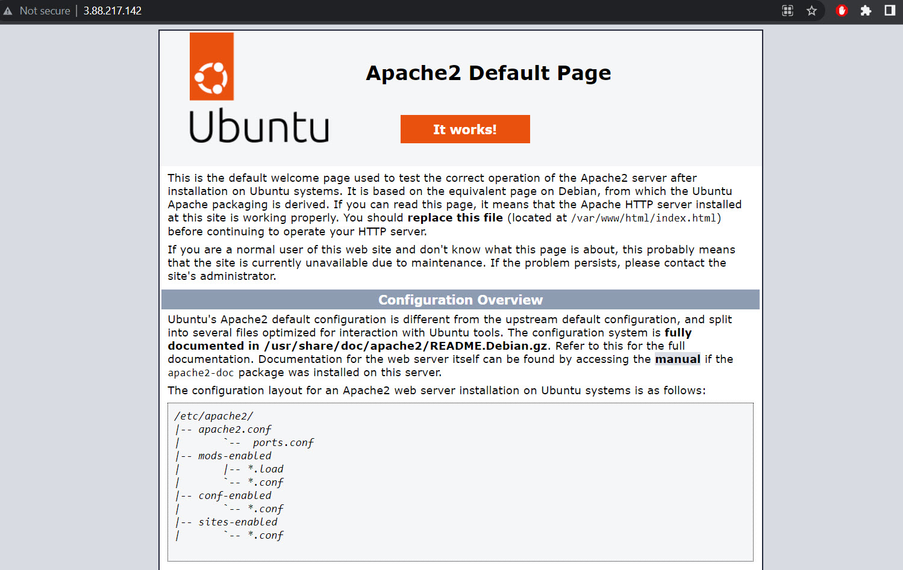
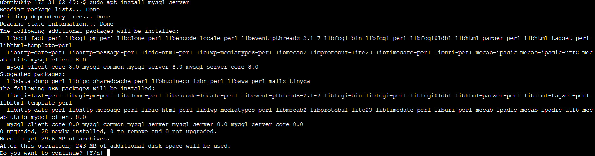
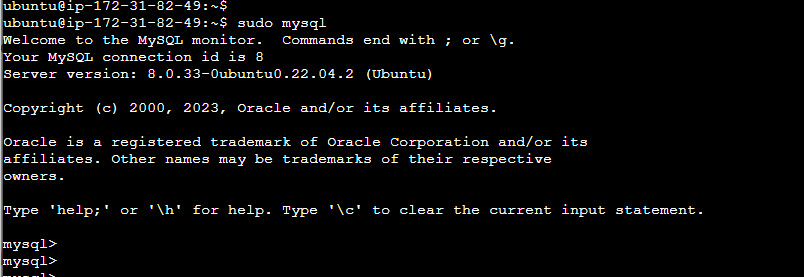
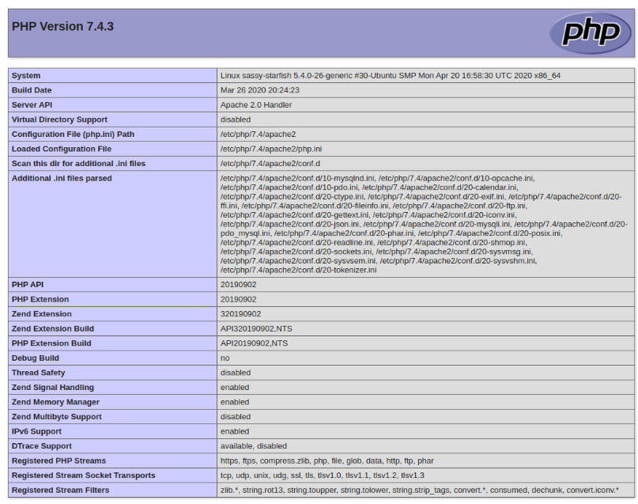

# Preparing prerequisites
## Step 0 - Creating the virtual server with Ubuntu Server OS
1. Launch a new EC2 instance of t2.micro family with Ubuntu Server 20.04 LTS (HVM) in the preferred region
2. Download and save your private key (.pem file) securely and do not share it with anyone!
   - If you lose it, you will not be able to connect to your server ever again!
  **IMPORTANT NOTICE** - Both Putty and ssh use the SSH protocol to establish connectivity between computers. It is the most secure protocol because it uses crypto algorithms to encrypt the data that is transmitted - it uses TCP port 22 which is open for all newly created EC2 intances in AWS by default.
3. Change the permissions for the private key file (.pem)  
    `sudo chmod 0400 <private-key-name>.pem`
4. Connect to the instance by running  
    `ssh -i <private-key-name>.pem ubuntu@<Public-IP-address>`

## Step 1 - Installing Apache and Updating the Firewall
1. Install the Apache using Ubuntu's package manager `apt`  
   #update a list of packages in package manager  
    `sudo apt update`  
    

    #run apache2 package installation  
    `sudo apt install apache2`  
    

2. To verify that apache2 is running as a Service in our OS, use following command  
    `$ sudo systemctl status apache2`  
    

    If it is green and running, then you did everything correctly - you have just launched your first Web Server in the Clouds!

3. Before we can receive any traffic by our Web Server, we need to open TCP port 80 which is the default port that web browsers use to access web pages on the Internet.
   

   

   

## Step 2 - Installing MySQL
1. Use `apt` to acquire and install the MySQL software  
   `sudo apt install mysql-server`  
   

2. After the successful installation of MySQL, login to it by typing  
   `sudo mysql`  
   

3. It’s recommended that you run a security script that comes pre-installed with MySQL. This script will remove some insecure default settings and lock down access to your database system. Before running the script you will set a password for the root user, using mysql_native_password as default authentication method. We’re defining this user’s password as `PassWord.1`.  
   `ALTER USER 'root'@'localhost' IDENTIFIED WITH mysql_native_password BY 'PassWord.1'`;  
4. Exit the MySQL shell with `exit`  
5. Start the interactive script by running `sudo mysql_secure_installation`  
   This will ask if you want to configure the `VALIDATE PASSWORD PLUGIN`  
   **NOTE:** Enabling this feature is something of a judgment call. If enabled, passwords which don’t match the specified criteria will be rejected by MySQL with an error. It is safe to leave validation disabled, but you should always use strong, unique passwords for database credentials.

## Step 3 - Installing PHP
You have Apache installed to serve your content and MySQL installed to store and manage your data. PHP is the component of our setup that will process code to display dynamic content to the end user. In addition to the `php` package, you’ll need `php-mysql` , a PHP module that allows PHP to communicate with MySQL-based databases. You’ll
also need `libapache2-mod-php` to enable Apache to handle PHP files. Core PHP packages will automatically be installed as dependencies.  
1. To install these 3 packages at once, run:  
   `sudo apt install php libapache2-mod-php php-mysql`  
2. At this point, your LAMP stack is completely installed and fully operational.
   - [x] Linux (Ubuntu)
   - [x] Apache HTTP Server
   - [x] MySQL
   - [x] PHP

## Step 4 - Enabling PHP on the Website
With the default DirectoryIndex settings on Apache, a file named `index.html` will always take precedence over an `index.php` file. This is useful for setting up maintenance pages in PHP applications, by creating a temporary `index.html` file containing an informative message to visitors. Because this page will take precedence over the `index.php` page, it will then become the landing page for the application. Once maintenance is over, the `index.html` is renamed or removed from the document root, bringing back the regular application page.   

In case you want to change this behavior, you’ll need to edit the /etc/apache2/mods-enabled/dir.conf file and change the order in which the `index.php` file is listed within the DirectoryIndex directive:
   `sudo vim /etc/apache2/mods-enabled/dir.conf`  

After saving and closing the file, you will need to reload Apache so the changes take effect:  
      `sudo systemctl reload apache2`  

