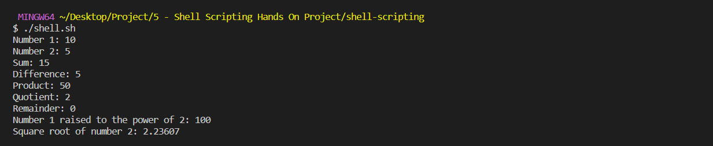
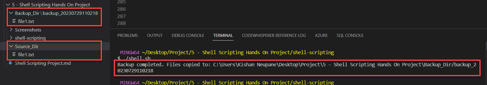

# Project 5: Shell Scripting Hands-on (Aux project)
## Introduction to Shell Scripting and User Input
### Shell Scripting Syntax Elements 

1. **Variables :** 
```sh
name="KISHAN"
echo $name
```


2. **Control Flow :**

```sh
#!/bin/bash

# Example script to check if a number is positive, negative, or zero

read -p "Enter a number: " num

if [ $num -gt 0 ]; then
    echo "The number is positive."
elif [ $num -lt 0 ]; then
    echo "The number is negative."
else
    echo "The number is zero."
fi
```


```sh
#!/bin/bash

# Example script to print numbers from 1 to 5 using a for loop

for (( i=1; i<=6; i++ ))
do
    echo $i
done
```


3. **Command Substitution :**

```sh
current_date=`date +%Y-%m-%d`

current_date=$(date +%Y-%m-%d)

```

4. **Input and Outpu :**
   
```sh
echo "Kishan"

echo "Hello World!"

echo "hello world" > index.txt

grep "pattern" < input.txt

echo "hello world" | grep "pattern"

```


5. **Functions :**

```sh
#!/bin/bash

# Define a function to greet the user
greet() {
    echo "Hello, $1! Nice to meet you."
}

# Call the greet function and pass the name as an argument
greet "Kishan"

```


### Let's Write the first Shell Script


```sh
#!/bin/bash

# Prompt the user for their name
echo "Enter your name:"
read name

# Display a greeting with the entered name
echo "Hello, $name! Nice to meet you."
```
```sh
sudo chmod +x shell.sh

./shell.sh

```


## Directory Manipulation and Navigation

```sh
#!/bin/bash

# Display current directory
echo "Current directory: $PWD"

# Create a new directory
echo "Creating a new directory..."
mkdir my_directory
echo "New directory created."

# Change to the new directory
echo "Changing to the new directory..."
cd my_directory
echo "Current directory: $PWD"

# Create some files
echo "Creating files..."
touch file1.txt
touch file2.txt
echo "Files created."

# List the files in the current directory
echo "Files in the current directory:"
ls

# Move one level up
echo "Moving one level up..."
cd ..
echo "Current directory: $PWD"

# Remove the new directory and its contents
echo "Removing the new directory..."
rm -rf my_directory
echo "Directory removed."

# List the files in the current directory again
echo "Files in the current directory:"
ls
```

```sh
sudo chmod +x shell.sh

./shell.sh

```


## File Operation and Sorting

```sh
#!/bin/bash

# Create three files
echo "Creating files..."
echo "This is file3." > file3.txt
echo "This is file1." > file1.txt
echo "This is file2." > file2.txt
echo "Files created."

# Display the files in their current order
echo "Files in their current order:"
ls

# Sort the files alphabetically
echo "Sorting files alphabetically..."
ls | sort > sorted_files.txt
echo "Files sorted."

# Display the sorted files
echo "Sorted files:"
cat sorted_files.txt

# Remove the original files
echo "Removing original files..."
rm file1.txt file2.txt file3.txt
echo "Original files removed."

# Rename the sorted file to a more descriptive name
echo "Renaming sorted file..."
mv sorted_files.txt sorted_files_sorted_alphabetically.txt
echo "File renamed."

# Display the final sorted file
echo "Final sorted file:"
cat sorted_files_sorted_alphabetically.txt

```

```sh
sudo chmod +x shell.sh

./shell.sh
```


## Working with Numbers and Calculations

```sh
#!/bin/bash

# Define two variables with numeric values
num1=10
num2=5

# Perform basic arithmetic operations
sum=$((num1 + num2))
difference=$((num1 - num2))
product=$((num1 * num2))
quotient=$((num1 / num2))
remainder=$((num1 % num2))

# Display the results
echo "Number 1: $num1"
echo "Number 2: $num2"
echo "Sum: $sum"
echo "Difference: $difference"
echo "Product: $product"
echo "Quotient: $quotient"
echo "Remainder: $remainder"

# Perform some more complex calculations
power_of_2=$((num1 ** 2))
square_root=$(awk "BEGIN{ sqrt=$num2; print sqrt }")

# Display the results
echo "Number 1 raised to the power of 2: $power_of_2"
echo "Square root of number 2: $square_root"

```

```sh
sudo chmod +x shell.sh

./shell.sh

```


## File Backup and Timestamping

```sh
#!/bin/bash

# Define the source directory and backup directory
source_dir="C:\Users\Kishan Neupane\Desktop\Project\5 - Shell Scripting Hands On Project\Source_Dir"
backup_dir="C:\Users\Kishan Neupane\Desktop\Project\5 - Shell Scripting Hands On Project\Backup_Dir"

# Create a timestamp with the current date and time
timestamp=$(date +"%Y%m%d%H%M%S")

# Create a backup directory with the timestamp
backup_dir_with_timestamp="$backup_dir/backup_$timestamp"

# Create the backup directory
mkdir -p "$backup_dir_with_timestamp"

# Copy all files from the source directory to the backup directory
cp -r "$source_dir"/* "$backup_dir_with_timestamp"

# Display a message indicating the backup process is complete
echo "Backup completed. Files copied to: $backup_dir_with_timestamp"

```

```sh
sudo chmod +x shell.sh

./shell.sh
```



